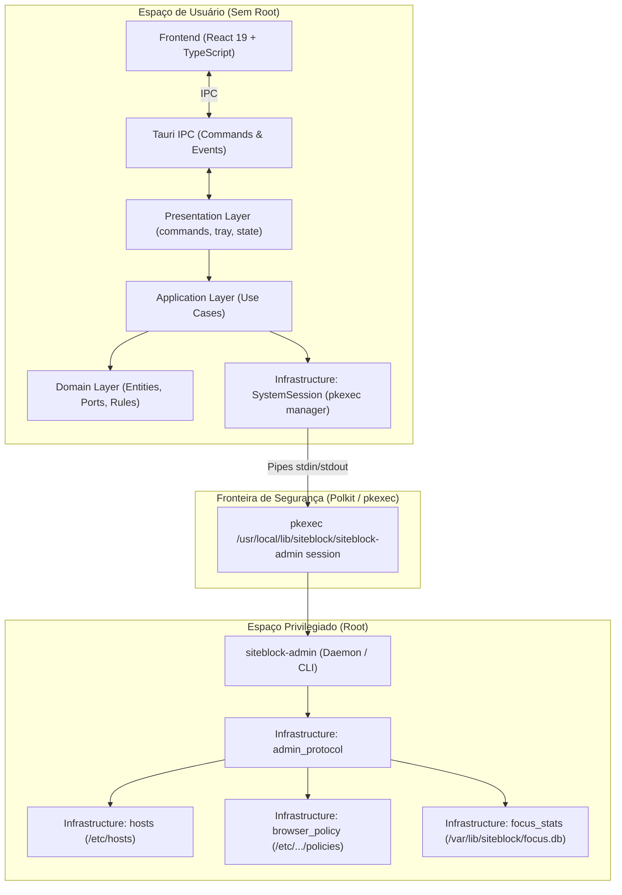

# Arquitetura do SiteBlock

Este documento descreve a arquitetura técnica, os princípios de design, o modelo de segurança e as convenções adotadas no **SiteBlock**.

---

## 1. Visão Geral do Sistema

O SiteBlock é um aplicativo desktop projetado para controle de foco e produtividade, permitindo o bloqueio programado de domínios na web diretamente no nível do sistema operacional e dos navegadores.

O sistema opera com um modelo de **dois processos e separação de privilégios**:
1. **Frontend + Core Tauri (Espaço de Usuário)**: Interface em React 19 / TypeScript e runtime Tauri em Rust, executando sem permissões de root.
2. **Helper Administrativo (`siteblock-admin`) (Espaço Privilegiado)**: Processo auxiliar independente disparado sob demanda via `pkexec` (Polkit) para aplicar configurações em arquivos protegidos do sistema (`/etc/hosts`, `/etc/opt/chrome/policies/...`, `/etc/firefox/policies/...`).



---

## 2. As Camadas da Clean Architecture (`src-tauri`)

O backend Rust está organizado estritamente de acordo com a **Clean Architecture / Ports and Adapters (Arquitetura Hexagonal)**:

```
src-tauri/src/
├── domain/            # 1. Regras de negócio puras e contratos (independente de frameworks)
├── application/       # 2. Casos de uso e orquestrações de fluxo
├── infrastructure/    # 3. Adaptadores concretos de SO, arquivos, banco e processos
├── presentation/      # 4. Adaptadores de interface (Tauri commands, tray, menus)
├── bin/
│   └── admin.rs       # Ponto de entrada do executável privilegiado siteblock-admin
└── lib.rs             # Configuração do builder e plugins Tauri v2
```

### 2.1. Camada de Domínio (`domain/`)
- **Responsabilidade**: Define as entidades centrais, regras de cálculo e contratos (traits/ports).
- **Regra de Ouro**: **Nunca** importa nada de `infrastructure`, `presentation` ou da API do Tauri.
- **Arquivos principais**:
  - `entities.rs`: Entidades ricas com métodos de negócio:
    - `Schedule::applies_now(&self, now: DateTime<Local>) -> bool`: Avalia se uma janela de horário está ativa no momento (incluindo turnos que cruzam a meia-noite).
    - `Profile::is_active(&self, now: DateTime<Local>) -> bool`: Verifica se um perfil está ativo considerando seus horários.
    - `SiteBlockConfig::effective_blocked_domains(&self, now: DateTime<Local>) -> Vec<String>`: Agrega a união de todos os domínios ativos.
    - `SiteBlockConfig::should_block(&self, now: DateTime<Local>) -> bool`: Avalia se o bloqueio geral deve ser acionado.
  - `ports.rs`: Contratos tipados de inversão de dependência:
    - `HelperPort`: Verificação de instalação do helper no sistema.
    - `SessionPort`: Comunicação tipada com a sessão administrativa (`status()`, `set_config()`, `send_focus_statistics()`).
    - `InstallerPort`: Instalação dos arquivos privilegiados e regras de polkit.
  - `errors.rs`: Erros tipados da aplicação com `thiserror`.

### 2.2. Camada de Aplicação (`application/`)
- **Responsabilidade**: Coordena as ações do usuário executando fluxos de use cases.
- **Regra de Ouro**: Não sabe como a UI funciona nem como o sistema operacional aplica as regras; apenas orquestra o domínio e as portas.
- **Casos de Uso**:
  - `ToggleBlockingUseCase`: Alterna o estado de proteção prevenindo cliques concorrentes via `BusyGuard` atômico.
  - `StartSessionUseCase`: Inicia a sessão com o helper administrativo e recupera o estado.
  - `SaveConfigUseCase`: Valida e salva uma nova configuração migrada.
  - `GetStatusUseCase`: Lê o estado atual do sistema sem exigir privilégios de root.
  - `GetFocusStatisticsUseCase`: Consulta dados agregados de foco no SQLite.
  - `InstallServiceUseCase`: Instala os binários privilegiados no sistema.

### 2.3. Camada de Infraestrutura (`infrastructure/`)
- **Responsabilidade**: Implementa as interfaces da camada de domínio, interagindo com o disco, processos externos, rede e banco de dados.
- **Componentes especializados**:
  - `hosts.rs`: Renderização limpa de blocos gerenciados no `/etc/hosts` e gravação atômica (`atomic_write`).
  - `browser_policy.rs`: Sistema declarativo de políticas de navegadores (`BrowserEngine` e `BrowserSpec`).
  - `admin_protocol.rs`: Roteamento e despacho de mensagens JSON consumidas pelo helper privilegiado.
  - `focus_stats.rs`: Persistência de sessões de foco em banco de dados SQLite local (`/var/lib/siteblock/focus.db`).
  - `system_session.rs`: Gerenciador de subprocesso `pkexec` com comunicação IPC bidirecional via pipes `stdin`/`stdout`.
  - `system_helper.rs`: Verificações locais de binários instalados no `/usr/local/lib/siteblock/`.
  - `system_core.rs`: Facade e orquestrador de alto nível entre os adaptadores de infraestrutura.

### 2.4. Camada de Apresentação (`presentation/`)
- **Responsabilidade**: Interface de entrada do Tauri (commands, system tray e menu).
- **Componentes**:
  - `commands.rs`: Handlers invocados pelo frontend React via `invoke("nome_do_comando")`.
  - `tray.rs`: Controlador do ícone da barra de tarefas (Tray Icon) com visualização de estados (Ativo, Desativado, Ocupado, Erro).
  - `state.rs`: `AppState` gerenciado pelo Tauri com injeção de dependências dos use cases e portas.
  - `menu.rs`: Menu nativo da janela desktop e atalhos de teclado.

---

## 3. Arquitetura do Frontend (`src`)

O frontend do SiteBlock é uma Single Page Application construída com **React 19**, **TypeScript** e **Vite**, projetada segundo princípios de arquitetura orientada a componentes, separação estrita de responsabilidades e desacoplamento da camada de runtime do Tauri.

```mermaid
graph TD
    subgraph "Camada de Apresentação (App Shell & Layout)"
        AppShell["App Shell (App.tsx)"]
        Layout["Layout Compartilhado (TopBar, HeroSection, Footer, MasterSwitch)"]
        SharedUI["Componentes Compartilhados (src/components/ui - shadcn/Radix)"]
    end

    subgraph "Fatias Verticais de Negócio (src/features/)"
        DomainsFeature["features/domains (Manager, Form, List, Item, Validador)"]
        SchedulesFeature["features/schedules (Manager, Card, Pickers, Helpers)"]
        ProfilesFeature["features/profiles (Tabs, Dialog, Constantes)"]
        BrowserFeature["features/browser (StatusList, Item, RestartDialog, Icon)"]
        StatsFeature["features/statistics (Painel Recharts, Hook, DTOs, Helpers) - Lazy"]
        PrefsFeature["features/preferences (Painel de Config, AboutDialog) - Lazy"]
    end

    subgraph "Camada de Estado Global (Zustand Stores)"
        SiteBlockStore["useSiteBlockStore (Config, Perfis, Domínios, Agendamentos)"]
        UIStore["useUIStore (Busy, Modais, Notificações Tipadas)"]
        PreferencesStore["usePreferencesStore (Única Fonte de Verdade: settings.json)"]
    end

    subgraph "Camada de Internacionalização (i18n)"
        TranslationsCatalog["Dicionários Tipados Puros (translations.ts)"]
        LangContext["LanguageProvider / useLanguage (index.tsx)"]
    end

    subgraph "Camada de Serviços & Abstração IPC"
        ISiteBlockApi["<<interface>> ISiteBlockApi (Comandos, State & Menu Events)"]
        TauriApi["TauriSiteBlockApi (invoke / listen)"]
        SonnerToast["Notificações Semânticas (Sonner)"]
    end

    subgraph "Runtime Tauri (Rust)"
        BackendCommands["Tauri Commands & Events"]
    end

    AppShell --> Layout
    AppShell --> DomainsFeature
    AppShell --> SchedulesFeature
    AppShell --> ProfilesFeature
    AppShell --> BrowserFeature
    AppShell --> StatsFeature
    AppShell --> PrefsFeature
    DomainsFeature --> SharedUI
    SchedulesFeature --> SharedUI
    ProfilesFeature --> SharedUI
    BrowserFeature --> SharedUI
    StatsFeature --> SharedUI
    PrefsFeature --> SharedUI
    DomainsFeature -->|Seletores Granulares| SiteBlockStore
    DomainsFeature -->|Seletores Granulares| UIStore
    SchedulesFeature -->|Seletores Granulares| SiteBlockStore
    ProfilesFeature -->|Seletores Granulares| SiteBlockStore
    BrowserFeature -->|Seletores Granulares| SiteBlockStore
    StatsFeature -->|Seletores Granulares| SiteBlockStore
    PrefsFeature -->|Seletores Granulares| SiteBlockStore
    UIStore --> SonnerToast
    SiteBlockStore -->|Notificações Tipadas| UIStore
    SiteBlockStore --> ISiteBlockApi
    PreferencesStore -->|Consome Dicionários| TranslationsCatalog
    LangContext -->|Consome Estado Reativo| PreferencesStore
    DomainsFeature --> LangContext
    SchedulesFeature --> LangContext
    ProfilesFeature --> LangContext
    BrowserFeature --> LangContext
    StatsFeature --> LangContext
    PrefsFeature --> LangContext
    ISiteBlockApi <|.. TauriApi
    TauriApi <-->|IPC Commands & Events| BackendCommands
```

### 3.1. Estrutura de Diretórios do Frontend

A aplicação adota uma organização por **fatias verticais (`features/`)**, onde cada módulo de negócio encapsula seus componentes, hooks, validadores/helpers utilitários e testes unitários. Componentes visuais atômicos do Design System (`components/ui/` do shadcn) e elementos de layout compartilhados permanecem em `components/`:

```
src/
├── features/            # Fatias verticais orientadas a domínio de negócio
│   ├── browser/         # Gerenciamento de navegadores (Chrome, Firefox, etc.)
│   │   ├── components/  # BrowserStatusList, BrowserItem, BrowserRestartDialog, BrowserIcon
│   │   ├── __tests__/   # Testes unitários do recurso de navegadores
│   │   └── index.ts     # Ponto de exportação pública da feature
│   ├── domains/         # Gestão de domínios bloqueados
│   │   ├── components/  # DomainManager, DomainForm, DomainList, DomainItem
│   │   ├── utils/       # Validador de domínio (domainValidator.ts)
│   │   ├── __tests__/   # Testes de componentes e validação de domínios
│   │   └── index.ts     # Ponto de exportação pública da feature
│   ├── preferences/     # Preferências do usuário e diálogo Sobre
│   │   ├── components/  # PreferencesPanel, AboutDialog (carregados via lazy)
│   │   ├── __tests__/   # Testes unitários do painel de preferências
│   │   └── index.ts     # Ponto de exportação pública da feature
│   ├── profiles/        # Perfis de foco (Tabs, criação, edição)
│   │   ├── components/  # ProfileTabs, ProfileDialog
│   │   ├── constants/   # Cores, ícones e presets de perfil
│   │   └── index.ts     # Ponto de exportação pública da feature
│   ├── schedules/       # Agendador semanal e faixas de horário
│   │   ├── components/  # ScheduleManager, ScheduleCard, DayPicker, TimeRangePicker
│   │   ├── utils/       # Helpers de manipulação de horário (scheduleHelpers.ts)
│   │   ├── __tests__/   # Testes do gerenciador e cálculos de agenda
│   │   └── index.ts     # Ponto de exportação pública da feature
│   └── statistics/      # Painel de métricas e histórico de foco
│       ├── components/  # FocusStatisticsPanel (Recharts)
│       ├── hooks/       # useFocusStatistics (orquestração assíncrona)
│       ├── utils/       # Utilitários de cálculo e formatação de métricas
│       ├── types/       # Tipos dedicados de estatísticas
│       ├── __tests__/   # Testes do painel e agregações de dados
│       └── index.ts     # Ponto de exportação pública da feature
├── components/          # Componentes visuais compartilhados e layout
│   ├── common/          # Componentes genéricos compartilhados (LoadingScreen, etc.)
│   ├── controls/        # Controles globais (MasterSwitch de ativação/desativação)
│   ├── hero/            # Banner principal com status de proteção e perfis ativos
│   ├── layout/          # Estrutura de tela (TopBar, Footer)
│   ├── setup/           # Banners e alertas do helper privilegiado
│   └── ui/              # Primitivas acessíveis do Design System (shadcn + Radix UI)
├── constants/           # Constantes globais do sistema (config inicial, etc.)
├── hooks/               # Custom hooks de escopo global (useSiteBlock)
├── stores/              # Stores Zustand (useSiteBlockStore, useUIStore, usePreferencesStore)
├── services/            # Abstração de IPC e comunicação com o backend (siteblockApi)
├── i18n/                # Dicionários puros (translations.ts) e Provider de contexto (index.tsx)
├── types/               # Tipos TypeScript espelhando os DTOs do Rust
└── utils/               # Logger, formatador de erros e utilitários globais
```

### 3.2. Gerenciamento de Estado (Zustand Stores)

O estado da aplicação é segregado em três stores especializadas para evitar re-renderizações desnecessárias e manter fronteiras claras, com seletores granulares e referências vazias estáticas (`EMPTY_DOMAINS`, `EMPTY_SCHEDULES`, etc.) garantindo estabilidade referencial:

1. **`useSiteBlockStore` (`src/stores/useSiteBlockStore.ts`)**:
   - **Responsabilidade**: Armazena e sincroniza o estado central do aplicativo (`SiteBlockState`), perfis, domínios, agendamentos e lista de navegadores habilitados.
   - **Garantia de Atomicidade**: Operações de mutação (`toggleEnabled`, `addDomain`, `saveSchedules`, `createProfile`, etc.) realizam validações locais antes de persistir e utilizam a função `commit()` para enviar o novo estado ao backend via IPC. Caso o backend rejeite a alteração, o estado é revertido e uma notificação de erro tipada é despachada.
   - **Injeção de Dependência**: A store aceita instâncias customizadas de `ISiteBlockApi`, viabilizando testes unitários e de integração 100% isolados da WebView do Tauri.

2. **`useUIStore` (`src/stores/useUIStore.ts`)**:
   - **Responsabilidade**: Controla estados efêmeros da interface do usuário.
   - **Sistema de Notificações Tipadas (`notify`)**: Despacha mensagens semânticas (`"success" | "error" | "warning" | "info"`) diretamente para o componente `Toaster` do `sonner`, eliminando parsers frágeis de substring no frontend.
   - **BusyGuard**: O sinalizador `busy` bloqueia interações e botões críticos durante invocações assíncronas do backend, prevenindo cliques duplos e condições de corrida no frontend.
   - **Modais e Mensagens**: Visibilidade de diálogos secundários (`preferencesOpen`, `aboutOpen`) e avisos globais (`integrationRequired`).

3. **`usePreferencesStore` (`src/stores/usePreferencesStore.ts`)**:
   - **Responsabilidade**: Fonte única de verdade para leitura, escrita e persistência de preferências do usuário no disco local via `@tauri-apps/plugin-store` (`settings.json`).
   - **Unificação com i18n**: Alimenta reativamente o `LanguageProvider` e provê a função utilitária `getTranslation()`, garantindo que mensagens de erro/sucesso geradas pelas stores sempre utilizem o idioma ativo no momento da execução.

### 3.3. Camada de Abstração IPC (`ISiteBlockApi`)

Para eliminar o acoplamento direto dos componentes com os módulos globais `@tauri-apps/api`, o frontend adota a interface `ISiteBlockApi`:

```typescript
export interface ISiteBlockApi {
  getStatus(): Promise<SiteBlockState>;
  startPrivilegedSession(): Promise<SiteBlockState>;
  saveConfig(config: SiteBlockConfigDto): Promise<SiteBlockState>;
  installService(): Promise<SiteBlockState>;
  getFocusStatistics?(query: FocusStatisticsQuery): Promise<FocusStatistics>;
  onStateChanged?(callback: (state: SiteBlockState) => void): Promise<() => void> | (() => void);
  onOpenPreferences?(callback: () => void): Promise<() => void> | (() => void);
  onOpenAbout?(callback: () => void): Promise<() => void> | (() => void);
}
```

- **Implementação em Produção (`TauriSiteBlockApi`)**:
  - Utiliza `invoke<T>` do Tauri para despachar comandos ao backend Rust.
  - Ouve eventos de atualização de estado emitidos pelo backend (`siteblock://state-changed`) e eventos de menu nativo (`siteblock://open-preferences`, `siteblock://open-about`).
  - Instrumenta cada chamada com telemetria de latência (`performance.now()`) e logs estruturados categorizados (`[State]`, `[Config]`, `[Session]`, `[Service]`).
- **Testabilidade**:
  - Em suítes de teste (Vitest), uma implementação mock de `ISiteBlockApi` é injetada, permitindo simular latência de rede, falhas de permissão e respostas em milissegundos sem qualquer dependência de binários compilados.

### 3.4. Code-Splitting e Otimização de Performance

Para garantir carregamento instantâneo do shell principal e manter o bundle inicial reduzido:
- **Carregamento Sob Demanda (`React.lazy` + `Suspense`)**: Painéis mais pesados ou não visíveis no carregamento inicial (`FocusStatisticsPanel`, `PreferencesPanel`, `AboutDialog`) são carregados em chunks assíncronos separados.
- **Isolamento de Bibliotecas**: A biblioteca de gráficos `recharts` e dependências analíticas ficam contidas no chunk dinâmico de estatísticas, sem onerar a inicialização do app.

### 3.5. Primitivas de Design e Acessibilidade

O design visual é estruturado sobre o **Tailwind CSS v4** e primitivas não-estilizadas do **Radix UI**:
- **Acessibilidade WAI-ARIA**: Modais (`Dialog`), abas (`Tabs`), seletores e menus suspensos contêm gerenciamento automático de foco, suporte a teclas de atalho (ESC, setas direcionais, Tab) e atributos de acessibilidade para leitores de tela.
- **Feedback ao Usuário**: Notificações contextuais via `sonner` com suporte a temas dinâmicos (sucesso, aviso, erro).
- **Visualização de Dados**: O painel de estatísticas de foco integra a biblioteca `recharts` para gráficos temporais responsivos e indicadores de produtividade.

### 3.6. Sistema de Internacionalização (i18n)

A aplicação conta com um sistema de tradução desacoplado e de alto desempenho:
- **Dicionários Puros (`src/i18n/translations.ts`)**: Mapeamentos de tradução estritamente tipados e livres de dependências de runtime ou React.
- **Tipagem Estrita**: Tipagem de chaves (`TranslationKey`), garantindo em tempo de compilação que nenhuma chave inexistente seja referenciada.
- **Integração Reativa (`src/i18n/index.tsx`)**: O contexto `LanguageProvider` e o hook `useLanguage()` sincronizam-se automaticamente com a store `usePreferencesStore`.
- **Traduções Fora do React**: A função `getTranslation(key, values)` pode ser chamada diretamente dentro de stores Zustand ou serviços utilitários consumindo o idioma ativo.

---

## 4. Modelo de Integração com Navegadores (Data-Driven)

O bloqueio por `/etc/hosts` pode ser contornado por DNS seguro (DoH/DoT) embutido nos navegadores modernos. Por isso, o SiteBlock aplica **políticas corporativas nativas** diretamente nos navegadores.

A infraestrutura utiliza o **Padrão Strategy Orientado a Dados**:

```rust
#[derive(Debug, Clone, Copy, PartialEq, Eq)]
pub enum BrowserEngine {
    Chromium { managed_policy_path: &'static str },
    Gecko { policy_path: &'static str, ownership_path: &'static str },
}

pub struct BrowserSpec {
    pub name: &'static str,
    pub engine: BrowserEngine,
    pub binaries: &'static [&'static str],
    pub requires_restart: bool,
    pub supports_hot_reload: bool,
}
```

Toda a lógica de checagem, escrita atômica, remoção e hot reload itera dinamicamente sobre a tabela central `BROWSER_SPECS`:
- **Navegadores Chromium** (Chrome, Brave): recebem a chave `URLBlocklist` e são recarregados a quente em segundo plano usando a flag `--refresh-platform-policy`.
- **Navegadores Gecko** (Firefox): recebem a política `policies.WebsiteFilter.Block` protegida por digest SHA-256 e indicam na UI a necessidade de reinício quando modificadas.

---

## 5. Comunicação IPC Privilegiada

A comunicação entre a aplicação de usuário e o `siteblock-admin` ocorre via protocolo **JSON Lines sobre pipes padrão**:

1. A aplicação Tauri instancia `pkexec /usr/local/lib/siteblock/siteblock-admin session`.
2. O Polkit solicita autorização administrativa ao usuário (apenas uma vez ao iniciar a sessão).
3. O canal permanece aberto mantendo um loop em `run_session()` lendo linhas de `stdin` e respondendo em `stdout`:
   - `{"action": "status"}` -> Retorna o estado atual consolidado.
   - `{"action": "capabilities"}` -> Retorna as capacidades do helper instalado.
   - `{"action": "set-config", "config": { ... }}` -> Grava a configuração e aplica as políticas no sistema.
   - `{"action": "get-focus-statistics", "query": { ... }}` -> Consulta o histórico de foco.

---

## 6. Guias de Extensão ("Recipes")

### 6.1. Como Adicionar um Novo Navegador
Para adicionar suporte a um novo navegador (ex: **Microsoft Edge** ou **Vivaldi**):

1. Adicione a especificação em `src-tauri/src/infrastructure/browser_policy.rs` no array `BROWSER_SPECS`:
   ```rust
   BrowserSpec {
       name: "Edge",
       engine: BrowserEngine::Chromium {
           managed_policy_path: "/etc/opt/edge/policies/managed/com.luis.siteblock.json",
       },
       binaries: &["microsoft-edge", "microsoft-edge-stable"],
       requires_restart: false,
       supports_hot_reload: true,
   },
   ```
2. Adicione o identificador na constante de domínio em `src-tauri/src/domain/entities.rs`:
   ```rust
   pub const SUPPORTED_BROWSERS: [&str; 4] = ["Chrome", "Brave", "Firefox", "Edge"];
   ```
3. O frontend já consome a lista dinamicamente e exibirá o novo navegador sem alterações de UI.

### 6.2. Como Adicionar um Novo Caso de Uso no Backend
1. Crie o arquivo em `src-tauri/src/application/use_cases/meu_caso_de_uso.rs`.
2. Defina uma struct com dependências de portas (`Arc<dyn Port>`).
3. Exponha o use case em `src-tauri/src/presentation/state.rs`.
4. Crie um comando anotado com `#[tauri::command]` em `src-tauri/src/presentation/commands.rs`.
5. Registre o comando no `invoke_handler` em `src-tauri/src/lib.rs`.

### 6.3. Como Adicionar um Novo Recurso ou Tela no Frontend
1. **Tipos**: Defina novos tipos ou estenda os DTOs em `src/types/` (ou em `src/features/<feature>/types/` caso o escopo seja estritamente local à funcionalidade).
2. **Serviço IPC**: Adicione o método correspondente na interface `ISiteBlockApi` e na classe `TauriSiteBlockApi` em `src/services/siteblockApi.ts`.
3. **Estado Global**: Se o recurso envolver estado compartilhado entre múltiplos componentes ou persistência de backend, adicione os campos e ações na store correspondente (`useSiteBlockStore`, `useUIStore` ou `usePreferencesStore`).
4. **Traduções**: Adicione as chaves em português e inglês no catálogo puro em `src/i18n/translations.ts`.
5. **Fatia Vertical (`src/features/<feature>/`)**:
   - Crie a pasta do recurso em `src/features/<feature>/` com sua estrutura interna (`components/`, `utils/`, `hooks/`, `__tests__/`).
   - Reutilize as primitivas acessíveis do shadcn disponíveis em `src/components/ui/` e os componentes de layout compartilhado em `src/components/layout/`.
   - Conecte os componentes aos seletores granulares do Zustand com referências vazias estáticas (`EMPTY_*`) para evitar re-renderizações desnecessárias e loops de render no React.
   - Exponha apenas a API pública necessária no arquivo de barril `src/features/<feature>/index.ts`.
6. **Carregamento Otimizado**: Para painéis secundários ou diálogos pesados (ex.: gráficos Recharts, preferências), configure o carregamento sob demanda via `React.lazy` com `<Suspense>` no shell principal (`src/App.tsx`). Dentro desses componentes carregados dinamicamente, importe stores diretamente de seus módulos (`@/stores/useSiteBlockStore`) para evitar avisos de dependência circular de chunks pelo Rollup/Vite.
7. **Testes**: Adicione suítes de teste em `src/features/<feature>/__tests__/` cobrindo renderização acessível, interações de usuário (via `@testing-library/user-event`) e chamadas à API mockada.

---

## 7. Qualidade de Código, Linting e Testes

O projeto adota padrões rigorosos de compilação, linting, formatação e cobertura de testes para todo o ecossistema (Rust e TypeScript):

| Objetivo | Comando | Descrição |
|---|---|---|
| **Testes do Frontend** | `pnpm run test` | Executa todos os testes unitários e de integração com Vitest. |
| **Testes com Watch** | `pnpm run test:watch` | Executa testes do frontend em modo interativo de desenvolvimento. |
| **Lint Frontend** | `pnpm run lint:frontend` | Valida código TypeScript/React com ESLint (zero warnings). |
| **Formatação Frontend** | `pnpm run format:frontend` | Formata todo o código TypeScript, CSS e JSON com Prettier. |
| **Checar Formatação Frontend** | `pnpm run format:check:frontend` | Verifica se os arquivos do frontend seguem as regras do Prettier. |
| **Build Frontend** | `pnpm run build` | Valida tipos com `tsc` e gera o bundle de produção do Vite. |
| **Lint Rust** | `pnpm run lint:backend` | Executa o `cargo clippy` com warnings tratados como erro (`-D warnings`). |
| **Formatação Rust** | `pnpm run format:backend` | Formata todo o código Rust com `cargo fmt`. |
| **Checar Formatação Rust** | `pnpm run format:check:backend` | Valida formatação do Rust sem modificar arquivos. |
| **Testes Rust** | `pnpm run test:backend` | Executa todos os testes unitários e de integração do Rust. |
| **Lint Completo** | `pnpm run lint` | Executa a validação de lint do frontend e do backend. |
| **Formatação Completa** | `pnpm run format` | Aplica a formatação automática em todo o repositório. |
| **Grafo do Código** | `graphify update .` | Atualiza o grafo de dependências e conhecimento AST do repositório. |

